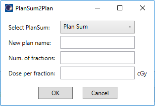

# PlanSum2Plan
A Varian ESAPI script that can be used to convert PlanSum into a more normal Verification plan. This comes in handy when two or more plans are coming from different CT images and are summed via registration onto a common image. The verification plan can be used, for example, as base dose plan in optimization.



## Setup

To use the script, you must compile it on your system. You should be able to open the project with Visual Studio 2019 Community Edition. Open the .sln file. 
The script was developed for Eclipse version 15.6. It may not work with other versions of Eclipse or Varian ESAPI. Particularly because of how PlanSums are coded in newer versions.

1. Add Varian dlls.
2. Compile as Release for x64.

## How to use the script

Run the script. Select the PlanSum you would like to convert. Type in a new name for the plan and click OK.


## Log


## Important note

**Before using this program see the [licence](https://github.com/brjdenis/VarianESAPI_PlanSum2Plan/blob/master/LICENSE) and make sure you understand it. The program comes with absolutely no guarantees of any kind.**

```
THE SOFTWARE IS PROVIDED "AS IS", WITHOUT WARRANTY OF ANY KIND, EXPRESS OR
IMPLIED, INCLUDING BUT NOT LIMITED TO THE WARRANTIES OF MERCHANTABILITY,
FITNESS FOR A PARTICULAR PURPOSE AND NONINFRINGEMENT. IN NO EVENT SHALL THE
AUTHORS OR COPYRIGHT HOLDERS BE LIABLE FOR ANY CLAIM, DAMAGES OR OTHER
LIABILITY, WHETHER IN AN ACTION OF CONTRACT, TORT OR OTHERWISE, ARISING FROM,
OUT OF OR IN CONNECTION WITH THE SOFTWARE OR THE USE OR OTHER DEALINGS IN THE
SOFTWARE.
```


## LICENSE

Published under the MIT license. 